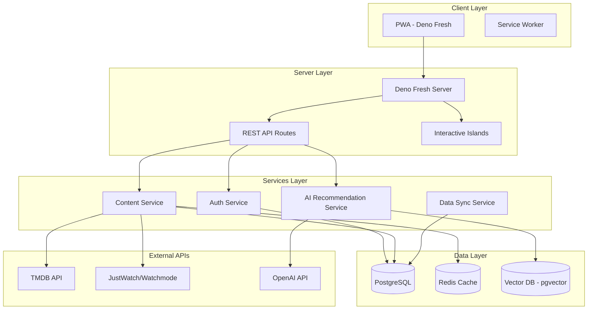
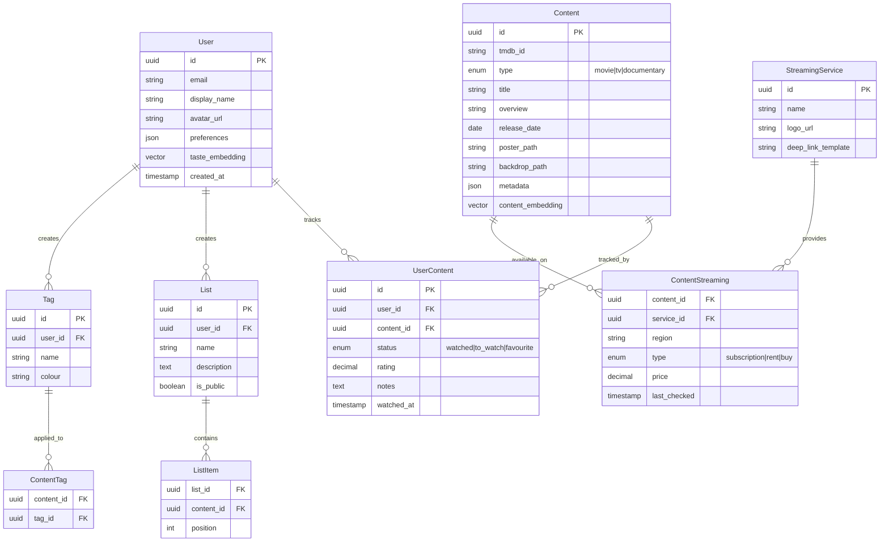
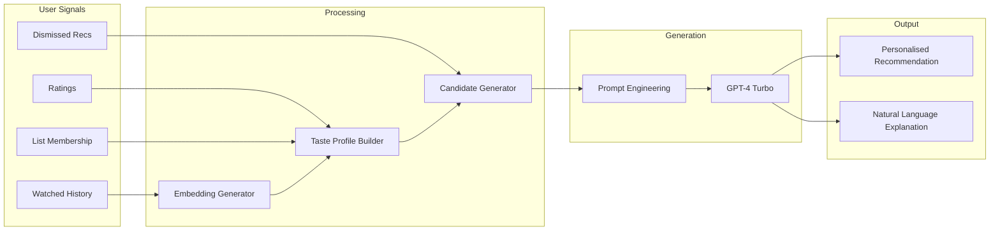

# Product Requirements Document: Streaming Discovery Platform

---

## 1. Executive Summary

This document defines the requirements for a streaming content discovery platform - a web application (with PWA support) that solves the fragmented streaming landscape problem. Users can discover where movies, TV shows, and documentaries are available across streaming services, track their viewing history, and receive intelligent AI-powered recommendations that explain *why* content suits their taste.

**Names:**

- **Steam Owl** - Wise recommendations, one stream at a time

---

## 2. Problem Statement

The modern viewer faces:

- **Fragmentation**: Content spread across 10+ streaming services with no unified search
- **Discovery paralysis**: Too much choice leads to endless scrolling and decision fatigue
- **Lost context**: Forgetting what you wanted to watch, or what friends recommended
- **Generic recommendations**: Platform algorithms optimise for engagement, not genuine taste matching
- **Subscription blindness**: Paying for services without knowing what's available

---

## 3. Target Audience

### Primary Users

- **Streaming subscribers** (25-45) juggling 2-6 services who want to maximise value
- **Film enthusiasts** who track what they watch and curate personal lists
- **Busy professionals** with limited leisure time who want quality recommendations

### Secondary Users

- **Couples/families** coordinating shared watchlists
- **Film club members** sharing recommendations

### Geographic Focus (MVP)

United Kingdom, United States, Canada, Australia, Germany, France

---

## 4. Product Vision

> "The intelligent companion that knows your taste, finds your content, and explains why you'll love it."

### Core Value Propositions

1. **Unified Search**: One place to search across all streaming services
2. **Smart Tracking**: Effortless logging with rich metadata
3. **Intelligent Recommendations**: AI that understands *why* you like what you like
4. **Taste Profile**: A living document of your cinematic preferences

---

## 5. Key Features

### 5.1 Content Discovery

```
┌─────────────────────────────────────────────────────────────┐
│  SEARCH & BROWSE                                            │
├─────────────────────────────────────────────────────────────┤
│  • Universal search across Movies, TV Shows, Documentaries  │
│  • Filter by streaming service, genre, year, rating         │
│  • Browse trending, new releases, leaving soon              │
│  • "Where to Watch" availability by user's region           │
│  • Deep links to streaming apps where supported             │
└─────────────────────────────────────────────────────────────┘
```

### 5.2 User Library & Lists

| Feature | Description |

|---------|-------------|

| **Watched** | Automatic logging with date, optional rating, notes |

| **To Watch** | Watchlist with priority ordering |

| **Favourites** | Curated best-of collection |

| **Custom Lists** | Unlimited user-created lists (e.g., "80s Horror", "Date Night") |

| **Tags** | User-defined tags for personal organisation |

| **Notes** | Private notes on any title |

| **Ratings** | 1-10 scale with half-point precision |

### 5.3 AI Recommendation Engine

The standout feature - an LLM-powered system that generates personalised recommendations with explanations:

```
┌─────────────────────────────────────────────────────────────┐
│  "Based on your viewing history, I think you'd love:        │
│                                                             │
│  🎬 THE GRAND BUDAPEST HOTEL                                │
│                                                             │
│  You've rated Wes Anderson's 'Moonrise Kingdom' 9/10 and    │
│  consistently enjoy films with distinctive visual style,    │
│  ensemble casts, and dark comedy. This shares Ralph         │
│  Fiennes' theatrical delivery you loved in 'In Bruges',     │
│  plus the whimsical production design that drew you to      │
│  'Amélie'. Available now on Disney+."                       │
│                                                             │
│  [Add to Watchlist]  [Not Interested]  [Tell me more]       │
└─────────────────────────────────────────────────────────────┘
```

**AI Capabilities:**

- Pattern recognition across genres, directors, actors, themes, tone
- Natural language explanations citing specific user history
- "Tell me more" conversational follow-up
- Mood-based suggestions ("I want something light tonight")
- Avoidance learning (respects "Not Interested" signals)

### 5.4 Content Detail Pages

- High-resolution poster and backdrop imagery
- Synopsis, cast, crew, runtime, release date
- Aggregate ratings (TMDB, IMDb, Rotten Tomatoes)
- Streaming availability with pricing (subscription/rent/buy)
- Trailer embed
- Similar titles
- User's personal notes and rating (if logged)
- "Friends who watched" (future consideration)

### 5.5 Sharing Features

- Shareable public profile with watched count, favourites
- Shareable lists via unique URLs
- "Share to..." integration (Twitter, WhatsApp, etc.)
- Embed widgets for blogs/websites

### 5.6 PWA Features

- Installable on iOS and Android home screens
- Offline access to user's library and lists
- Push notifications (new releases on watchlist services, AI recommendations)
- Fast, app-like navigation

---

## 6. User Stories

### Authentication

- As a user, I can sign up with email/password or social providers (Google, Apple, Facebook)
- As a user, I can link multiple auth providers to one account
- As a user, my data syncs across all devices

### Discovery

- As a user, I can search for any movie/TV show/documentary by title
- As a user, I can filter results by streaming service, genre, and release year
- As a user, I can see which streaming services have a title in my region
- As a user, I can deep-link directly to a streaming app to start watching

### Library Management

- As a user, I can add titles to Watched, To Watch, or Favourites with one tap
- As a user, I can rate titles on a 1-10 scale
- As a user, I can add private notes to any title
- As a user, I can create custom lists with names and descriptions
- As a user, I can apply multiple tags to any title
- As a user, I can bulk-import my viewing history (stretch goal)

### AI Recommendations

- As a user, I receive daily personalised recommendations in my feed
- As a user, I can ask for recommendations by mood or context
- As a user, I understand *why* each recommendation was made
- As a user, I can dismiss recommendations to improve future suggestions
- As a premium user, I get unlimited AI conversations about my taste

### Sharing

- As a user, I can share my lists via public links
- As a user, I can make my profile public or private
- As a user, I can share individual titles to social media

---

## 7. Technical Architecture

### Stack Overview



### Technology Choices

| Layer | Technology | Rationale |

|-------|------------|-----------|

| **Runtime** | Deno 2.x | Modern, secure, TypeScript-first |

| **Framework** | Fresh 2.x | Islands architecture, SSR, no build step |

| **Database** | PostgreSQL + pgvector | Relational + vector embeddings for AI |

| **Cache** | Redis/Upstash | API response caching, session storage |

| **Auth** | Deno KV + custom JWT | Or integrate with Auth.js/Lucia |

| **AI/LLM** | OpenAI GPT-4 | Recommendation generation |

| **Embeddings** | OpenAI text-embedding-3 | User taste vectors |

| **Hosting** | Deno Deploy | Edge deployment, global CDN |

| **Storage** | Cloudflare R2 / S3 | Image caching |

### Data Model (Core Entities)



---

## 8. External Data Sources

### Primary: TMDB (The Movie Database)

- Movie/TV metadata, images, cast, crew
- Free tier: 50 requests/second
- Required attribution

### Streaming Availability Options

| Provider | Coverage | Pricing | Notes |

|----------|----------|---------|-------|

| **JustWatch** | Excellent | Commercial license required | Industry standard |

| **Watchmode** | Good | Starts ~$10/month | Easier to access |

| **TMDB Watch Providers** | Limited | Free | Basic availability only |

| **Streaming Availability API** | Good | Pay-per-request | RapidAPI marketplace |

**Recommendation**: Start with TMDB Watch Providers (free), upgrade to Watchmode for MVP launch.

### Supplementary Data

- **OMDb API**: IMDb ratings, Rotten Tomatoes scores
- **YouTube Data API**: Trailer embeds

---

## 9. AI Recommendation System

### Architecture



### Taste Profile Generation

1. Each content item has a vector embedding (generated from synopsis, genres, themes)
2. User's taste = weighted average of watched content embeddings, weighted by rating
3. Profile updated on each watch/rate action
4. Stored in pgvector for efficient similarity search

### Recommendation Flow

1. **Candidate generation**: Vector similarity search for unwatched content similar to taste profile
2. **Filtering**: Remove dismissed items, apply availability filters
3. **Ranking**: Score by similarity + recency + diversity
4. **Explanation generation**: LLM prompt with user history context + candidate details
5. **Response**: Structured recommendation with natural language reasoning

### Example Prompt Structure

```
You are a film critic and personal recommendation engine. Based on the user's
viewing history and ratings, explain why they would enjoy the recommended film.

USER PROFILE:
- Highly rated: [list of 10 top-rated with genres]
- Recently watched: [last 5 films]
- Preferred genres: [extracted patterns]
- Actors they love: [frequently appearing in highly rated]

RECOMMENDATION: The Grand Budapest Hotel (2014)

Generate a 2-3 sentence explanation that:
1. References specific films from their history
2. Identifies shared qualities (director, tone, themes, actors)
3. Is conversational and enthusiastic but not sycophantic
```

---

## 10. Freemium Model

### Free Tier

- Unlimited search and browse
- Core lists (Watched, To Watch, Favourites)
- Up to 3 custom lists
- Basic AI recommendations (3 per day, no conversation)
- Ratings and notes
- Share lists publicly

### Premium Tier (~$4.99/month or $39.99/year)

- Unlimited custom lists
- Unlimited AI recommendations with conversation
- Advanced filtering and sorting
- "Leaving soon" alerts for watchlist items
- Export data (CSV, JSON)
- Priority support
- Early access to new features
- Ad-free experience

### Premium Conversion Triggers

- Hitting custom list limit
- Exceeding daily AI recommendation quota
- Attempting to export data

---

## 11. MVP Scope

### Phase 1: Foundation (Weeks 1-4)

- [ ] Project setup: Deno Fresh, PostgreSQL, authentication
- [ ] TMDB integration for content metadata
- [ ] Basic search and browse functionality
- [ ] Content detail pages with streaming availability
- [ ] User registration and authentication (email + Google)

### Phase 2: Library (Weeks 5-8)

- [ ] Watched, To Watch, Favourites lists
- [ ] Rating system (1-10)
- [ ] Notes functionality
- [ ] Custom lists (limited to 3 for free tier)
- [ ] Tags system

### Phase 3: Intelligence (Weeks 9-12)

- [ ] Content embedding generation pipeline
- [ ] User taste profile calculation
- [ ] Basic recommendation engine (vector similarity)
- [ ] LLM integration for recommendation explanations
- [ ] Daily recommendation delivery

### Phase 4: Polish (Weeks 13-16)

- [ ] PWA implementation (offline, install, notifications)
- [ ] Sharing features (public profiles, list links)
- [ ] Premium tier implementation (Stripe)
- [ ] Performance optimisation and caching
- [ ] Beta launch

---

## 12. Future Roadmap

### Post-MVP Enhancements

- Apple and Facebook authentication
- Additional regions (APAC, LATAM)
- TV show episode tracking
- "Continue watching" sync with streaming services (where APIs allow)
- Mood-based browsing ("I feel like something...")
- Curated editorial collections
- Annual "Year in Review" personalised stats
- Browser extension for one-click adding from streaming sites

### Long-term Vision

- Native mobile apps (iOS/Android)
- Friend/follow system with activity feeds
- Watch parties coordination
- Integration with cinema listings for theatrical releases
- B2B API for publishers and content creators

---

## 13. Success Metrics

### North Star Metric

**Weekly Active Users who log at least 1 piece of content**

### Supporting Metrics

| Category | Metric | Target (Month 3) |

|----------|--------|------------------|

| **Acquisition** | New signups/week | 500 |

| **Activation** | Users with 5+ items logged | 40% of signups |

| **Engagement** | Items logged/user/week | 2.5 |

| **Retention** | 7-day retention | 35% |

| **Revenue** | Premium conversion rate | 5% |

| **AI** | Recommendation engagement rate | 20% |

---

## 14. Risks & Mitigations

| Risk | Likelihood | Impact | Mitigation |

|------|------------|--------|------------|

| **Streaming availability API costs** | Medium | High | Start with free TMDB providers, upgrade based on traction |

| **OpenAI API costs** | Medium | Medium | Rate limiting, caching common recommendations, batch processing |

| **TMDB rate limits** | Low | Medium | Aggressive caching, background sync jobs |

| **Competition (Letterboxd, JustWatch)** | High | Medium | Differentiate on AI explanations and UX |

| **Streaming landscape changes** | Medium | Low | Modular provider architecture |

---

## 15. Appendix: UI/UX Principles

### Design Philosophy

- **Content-first**: Movie posters are the hero, UI fades into background
- **Speed**: Instant search, optimistic updates, skeleton loading
- **Delight**: Micro-animations, satisfying interactions
- **Accessibility**: WCAG 2.1 AA compliance, keyboard navigation

### Key Screens

1. **Home/Feed**: Personalised recommendations, continue watching, new releases
2. **Search**: Instant search with filters, results grid
3. **Content Detail**: Full metadata, where to watch, actions
4. **Library**: Tabbed view of all lists with filtering
5. **Profile**: Stats, public profile preview, settings
6. **AI Chat**: Conversational recommendation interface (premium)

---

*Document Version: 1.0*

*Last Updated: January 2026*